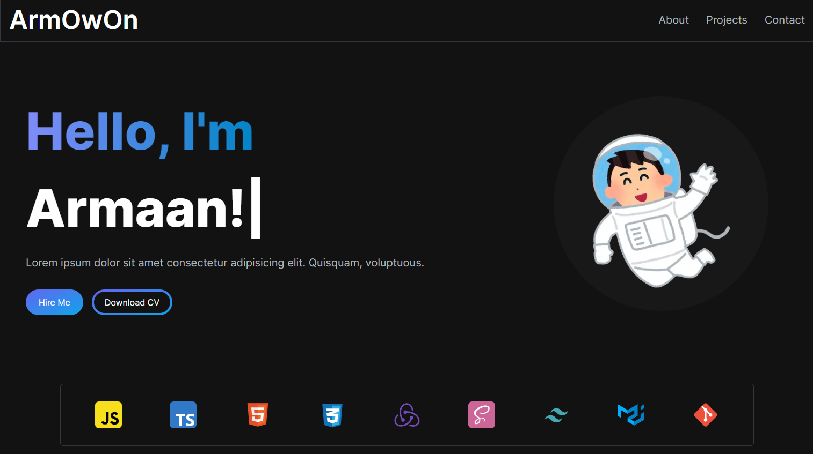

# Modern UI/UX website using ReactJS & TailwindCSS

[Live Site](https://personal-portfolio-xi-three.vercel.app/)

This is my Portfolio in hopes of getting me hired somewhere. nothing too crazy, just a simple one page Website.

## Technologies

NextJS, TypeScript, TailwindCSS.

## ## Run Locally

To run this project locally, follow these steps:

1. Clone this repository to your local machine.
2. Run `npm install` to install the required dependencies.
3. Run `npm run dev` to start the web server.

## Lessons Learned

Well, as this was a very simple project and I had no prior knowledge in Next.js, I tried it. Although you really don't use any of the Next.js features with small-scope websites, I just wanted to get comfortable with Next.js, and I learned small things here and there.
